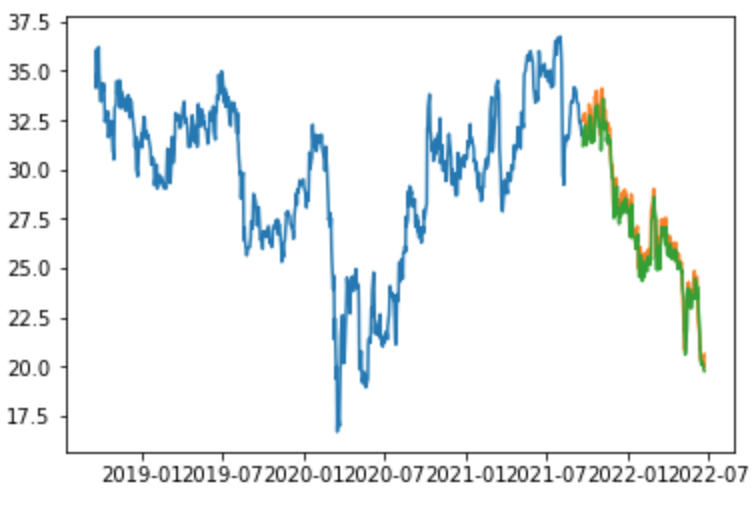
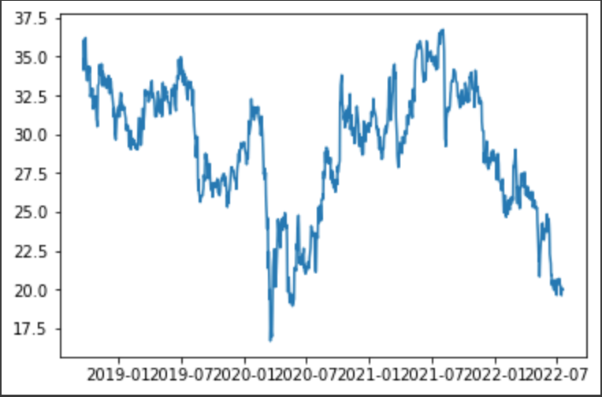
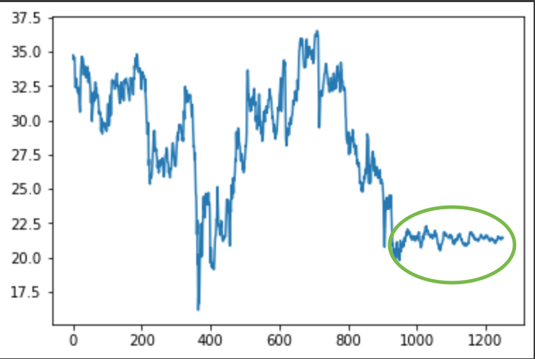
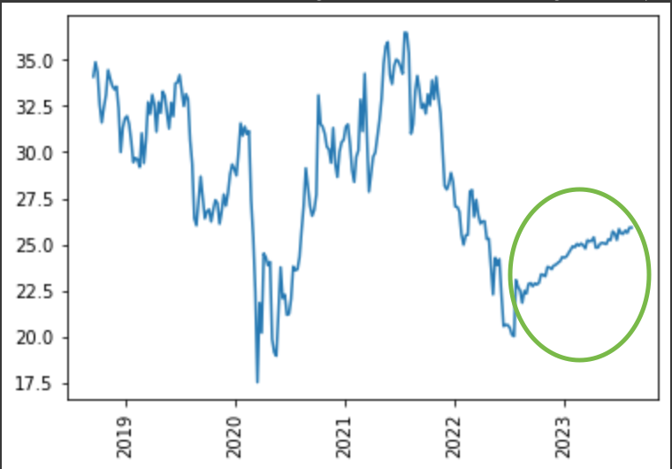

# ELAN Stock Prediction
**This project** compares, evaluates, and predicts ELAN stock price using Monte Carlo Simulation, FB Prophet, SMA, k-Nearest Neighbors, Arima, LSTM, and EMA.
---
---

Content incudes:

* [Technologies](#technologies)

* [Approaches](#approaches)

* [Results](#results)

* [Contributors](#contributors)

---

## Technologies
Include but not limited to the following:
>This project leverages python 3.7

* [Alpaca API](https://alpaca.markets/docs/) - Collect live stock information

* [Monte Carlo Forecast Tools](https://www.palisade.com/monte-carlo-simulation/) - Visualize all possiblities

* [Prophet](https://pypi.org/project/fbprophet/) - Time series forcasting

* [Google Colab](https://colab.research.google.com/?utm_source=scs-index) - Jupyter Notebook function in browser

* [Pandas](https://pandas.pydata.org/) - Data analysis and manipulation

* [Scikit-learn](https://scikit-learn.org) - Supplies machine learning libraries for Python

* [Keras](https://keras.io) - Provides deep learning API for Python interface

* [Yahoo Finance](https://pypi.org/project/yahoo-finance/) - Aquire stock data from Yahoo! Finance

* [Tensorflow](https://www.tensorflow.org) - Supplies machine learning libraries for Python

---

## Approaches
* Comparing ELAN and LLY performance
* Predict ELAN cumulative returns
* Explore Machine Learning models:
    * Simple Moving Average (SMA)
    * k-Nearest Neighbor
    * Auto ARIMA
    * Long Short Term Memory (LSTM)
* Perform future price predictions with the best model (LSTM):
    * Predict future 300 days price using historical daily closing price
    * Predict future 56 weeks performance using historical weekly average closing price

---

## Results
LSTM machine learning model performs the best among all explored models, thus, future predictions will be performed on LSTM model.

### **Historical daily closing price visualization**

---
---
### **Future 300 days prediction using daily closing price**

---
---
### **Future 56 weeks prediction using weekly average closing price**

---
---

## Contributors

**Yanjun Lin Andrie** &nbsp;&nbsp; |
&nbsp;&nbsp; email: yanjun.lin.andrie@gmail.com &nbsp;&nbsp;|
&nbsp;&nbsp; 

**UC Berkeley Extension**

---

## License

